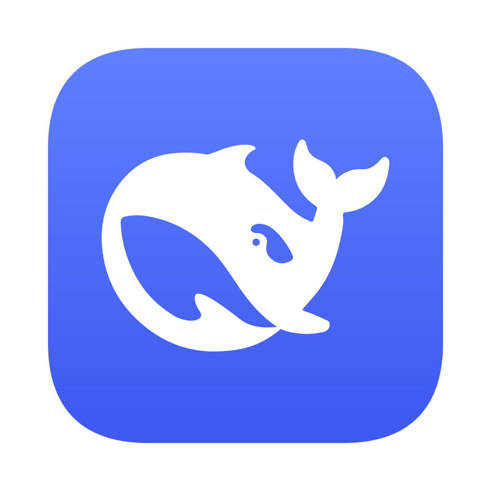
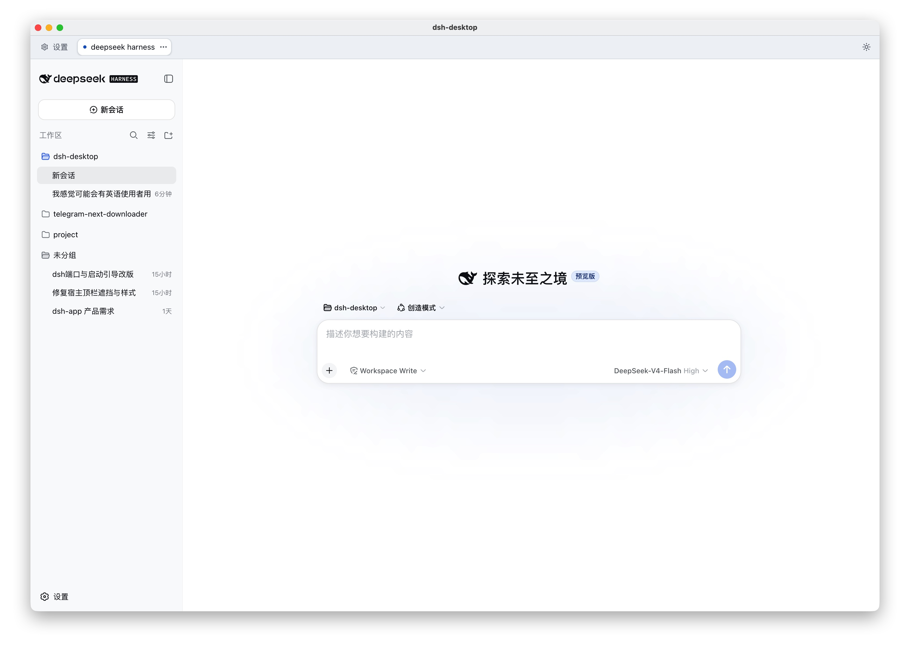
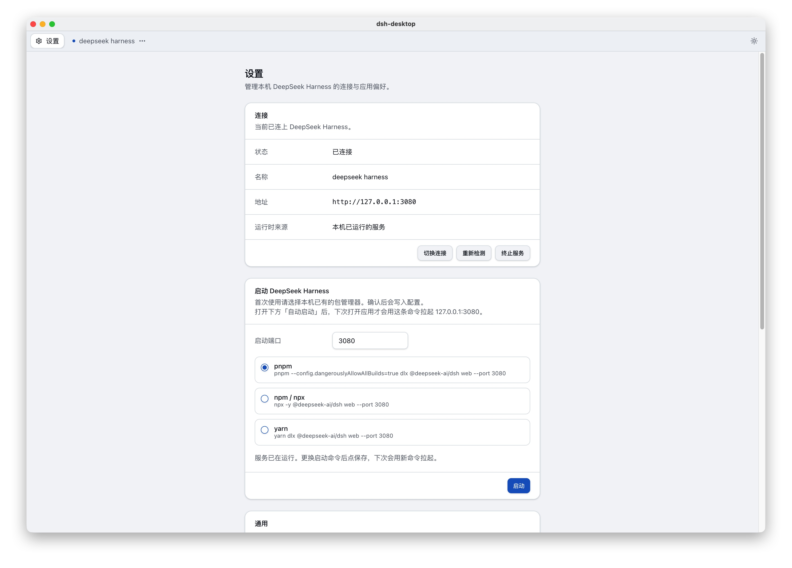

<p align="center">
  
</p>

<h1 align="center">dsh-desktop</h1>

<p align="center">
  给 <a href="https://github.com/deepseek-ai/deepseek-harness">DeepSeek Harness</a> 用的薄 macOS 宿主。<br>
  负责启动或连接 <code>dsh web</code>，把官方页面放在原生顶栏下面。
</p>

<p align="center">
  <a href="README.md">English</a> ·
  <a href="#安装">安装</a> ·
  <a href="#功能">功能</a> ·
  <a href="#开发">开发</a>
</p>

<p align="center">
  
  
  
  
  
</p>

这个仓库**不 fork** 官方项目。桌面端只负责进程、连接、托盘和设置。Agent 能力和官方 Web UI 仍在 DeepSeek Harness 里。

<p align="center">
  
</p>

## 为什么做这个

DeepSeek Harness 一般是在终端里跑 `dsh web` 或 `pnpm dlx`。能用，但终端一关就丢、端口也容易忘，更别说还想要一个能重连的菜单栏应用。

`dsh-desktop` 就是这层壳：

- 第一次打开会停在空状态，你没点确认前不会装任何东西
- 之后可以复用 `http://127.0.0.1:<端口>`，或替你拉起 `dsh web`
- 关窗口只是藏到托盘；`Cmd+Q`、应用菜单「退出」或托盘「退出」会真正退出

## 功能

- **薄宿主，官方 UI** — 官方页面跑在 44px 顶栏下面的 `WebContentsView` 里
- **先确认再安装** — 设置页列出本机已有的 `pnpm` / `npx` / `yarn` / `bunx`，点 **启动** 才执行
- **智能连接** — 复用本机已起来的端口，或连远程 `http(s)` 实例
- **托盘 + 单实例** — 全机只跑一份，菜单栏可重连
- **中英界面** — 简体中文 / English，默认跟随系统，设置里可改
- **只翻宿主** — 官方 DeepSeek Harness 页面的语言仍由官方 UI 自己决定

<p align="center">
  
</p>

## 安装

需要 **macOS**。未签名的 Apple Silicon / Intel DMG 从
[Releases](https://github.com/johnhom1024/dsh-desktop/releases) 下载。

推一个 `v*` tag（例如 `v0.1.0`）会跑两个 GitHub Actions job：一个打
`dsh-desktop-<version>-arm64.dmg`，一个打 `dsh-desktop-<version>-x64.dmg`，
连同各自的校验和文件挂到这个 tag 的 Release。

本地打包（默认仍是 Apple Silicon，日常 `pnpm dist:mac` 不变）：

```bash
pnpm install
pnpm dist:mac        # Apple Silicon
pnpm dist:mac:intel  # Intel
```

产物：

- `release/dsh-desktop-0.1.0-arm64.dmg`
- `release/dsh-desktop-0.1.0-x64.dmg`
- `release/SHA256SUMS-arm64.txt` / `release/SHA256SUMS-x64.txt`

打开时系统会提示未签名。在访达里右键 → **打开** 即可。

如果提示应用**已损坏，无法打开**，一般是未签名下载被 Gatekeeper 加上了隔离属性，不是安装包坏了。把应用放到 `/Applications` 后，在终端执行：

```bash
sudo xattr -r -d com.apple.quarantine /Applications/dsh-desktop.app
```

然后再打开即可。

签名和公证需要 Apple Developer ID，这里刻意不做。

## 第一次使用

1. 打开应用。如果 `127.0.0.1:3080` 还不是官方页，本机 tab 会停在空状态。
2. 打开 **设置**。
3. 选一个本机已经有的包管理器。
4. 点 **启动**。宿主会把这条命令写入 `settings.json`，并在设置页实时刷日志。
5. 官方页就绪后，会自动出现在顶栏下面。

可选：

- **自动启动 DeepSeek Harness** — 下次打开应用时，如果本机端口还没起来，就用已保存的命令拉起
- **登录时自动启动** — 仅打包后的 `.app`，开机后藏到托盘
- **语言** — 跟随系统 / 简体中文 / English。只影响宿主界面

## 连接逻辑

**本机** tab 只会在端口已经是官方 UI 时复用 `http://127.0.0.1:<端口>`（默认 `3080`）。端口没起来时，只有你在设置里确认过启动命令，才会跑 `dsh web --port <端口>`。不会因为 PATH 上有 `pnpm` 或 npx 缓存就自动 spawn。

远程 tab 只探测自己保存的 `http(s)` 地址。远程不通时**不会**改去拉本机进程。

| 检测到 | 启动命令 |
| --- | --- |
| pnpm | `pnpm --config.dangerouslyAllowAllBuilds=true dlx @deepseek-ai/dsh web --port 3080` |
| npx | `npx -y @deepseek-ai/dsh web --port 3080` |
| yarn | `yarn dlx @deepseek-ai/dsh web --port 3080` |
| bunx | `bunx @deepseek-ai/dsh web --port 3080` |

从访达打开打包后的 `.app` 时，经常看不到 Homebrew / pnpm。宿主会前置 `/opt/homebrew/bin`、`/usr/local/bin` 和用户的 pnpm 目录，并只读解析 shell 配置里的 `export PATH=`，**不会执行**这些文件。

## 开发

需要 Node 22.15+ 和 pnpm。

```bash
pnpm install
pnpm typecheck
pnpm test
pnpm dev
```

`pnpm dev` 会先起 Vite `127.0.0.1:5173`，再开 Electron。渲染层 CSS / React 走 HMR。改 `src/main` 或加依赖后要重启。

宿主顶栏是 React + Tailwind CSS v4 + shadcn/ui。官方页是 `WebContentsView`，宿主 HTML 的 `z-index` 盖不住它。会画出顶栏的页面必须先摘掉官方视图；往下展开的菜单用系统原生菜单。详见 [docs/host-overlays.md](docs/host-overlays.md)。

`Cmd+,` 打开设置。`Cmd+R` 只刷新官方页，不重载宿主顶栏。`Cmd+Option+I` / `F12` 打开当前焦点页的开发者工具。

完整功能说明：[docs/features.md](docs/features.md)。

## 配置文件

`settings.json` 在 Electron `userData` 里，macOS 上一般是 `~/Library/Application Support/dsh-desktop/`。

| 字段 | 含义 |
| --- | --- |
| `locale` | `system` / `zh-CN` / `en` |
| `autoStart` | 打开应用后是否自动拉起已保存命令 |
| `openAtLogin` | 登录自启，仅打包后生效 |
| `lastPackageManager` | 上次确认过的启动命令 |
| `windowBounds` | 记住窗口位置 |

日志：宿主事件写 `shell.log`，启动命令输出写 `web.log`。

## 明确不做

- 不 fork [deepseek-ai/deepseek-harness](https://github.com/deepseek-ai/deepseek-harness)
- 不翻译官方 Web UI
- 不做签名 / 公证 / Mac App Store
- 不做 `electron-updater` 自动下载安装
- 暂时没有 Windows / Linux 安装包

## 许可证

[MIT](LICENSE) © johnhom

DeepSeek Harness 是另一个项目，使用它自己的许可证。
